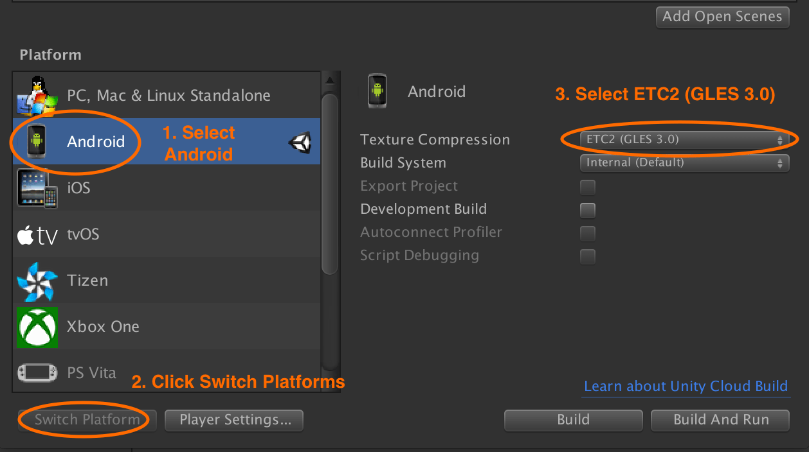

# Creating Unity builds for Idealens headsets

## Build settings

Building directly to a Idealens headset is the recommended method of running your app.

As the Idealens operating system is an Android derivative, the build platform for your project must be set to **Android**.

This can be done via the **File › Build Settings** menu option.

Select **Android** and then click the **Switch Platform** button.

Change the **Texture Compression** option to **ETC2 (GLES 3.0)**.

  

## Building directly to a Idealens headset

Connect your charged Idealens device via USB to your development machine and then select the **File › Build & Run** menu option in Unity.

Your app should then be installed and launched on the device.

## Building an APK

Select the **File › Build Settings** menu option in Unity.

Click the **Build** button and select where you would like to save the APK on your file system.

## Next: Optimization

See [optimizing your Idealens experience](/docs/optimizing-idealens-experiences.md).
