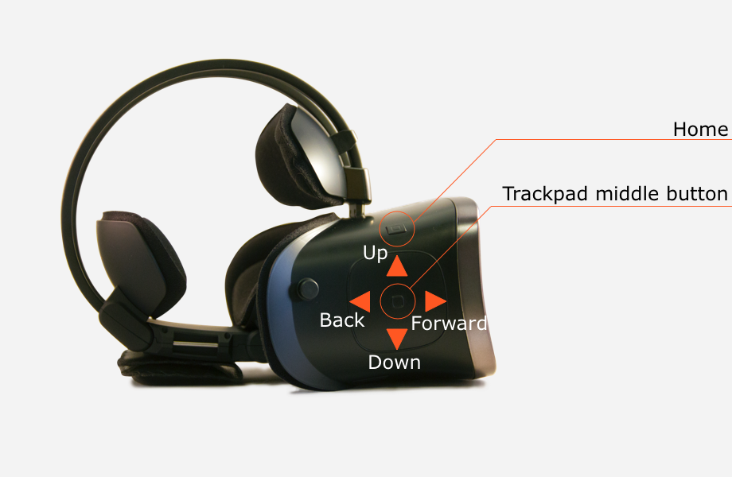

# Idealens headset buttons

Once you have [installed the Idealens VR Unity SDK](/docs/idealens-vr-unity-sdk-installation.md), you can begin to bind to button events from the headset.

## Headset buttons

Idealens headsets provides basic gaze-based pointer input and some additional buttons for operating system functionality.

<p align="center">
  
</p>

### Binding to headset buttons

The Idealens VR SDK provides a separate module, `IVR.IVRK2Event`, for listening to events triggered by the buttons or trackpad on the headset.

Events are subscribed by passing a method to one of the events on IVR.IVRK2Event.

```cs
IVR.IVRK2Event.TouchEvent_onSingleTap += HandlerMethod;
```

#### Touchpad events

##### TouchEvent_onSingleTap

Triggered when a finger touches the touchpad and leaves within one second

```cs
IVR.IVRK2Event.TouchEvent_onSingleTap += HandlerMethod;
```

##### TouchEvent_onLongPress

Triggered on the first frame in which the touchpad has been pressed for over one second without any sliding displacement

```cs
IVR.IVRK2Event.TouchEvent_onLongPress += HandlerMethod;
```

##### TouchEvent_onPress

Triggered on every frame in which the touchpad remains touched

```cs
IVR.IVRK2Event.TouchEvent_onPress += HandlerMethod;
```

##### TouchEvent_onPressDown

Triggered on the frame when a touch is first detected

```cs
IVR.IVRK2Event.TouchEvent_onPressDown += HandlerMethod;
```

##### TouchEvent_OnPressUp

Triggered on the first frame after a touch has ended

```cs
IVR.IVRK2Event.TouchEvent_OnPressUp += HandlerMethod;
```

#### Scroll & Swipe

##### TouchEvent_onScroll

Triggered on each frame in which a finger is sliding across the touchpad

```cs
IVR.IVRK2Event.TouchEvent_onScroll += HandlerMethod;
```

Where the handler method receives a single parameter: `IVRTouchPad.PointDelegate`, the distance the finger has slided.

Please note:

* the property delta.x is mapped to the *vertical* axis
* the property delta.y is mapped to the *horizontal* axis

##### TouchEvent_onSwipe

Triggered when a finger slides on the touchpad over 20%

```cs
IVR.IVRK2Event.TouchEvent_onSwipe += HandlerMethod;
```

Where the handler method receives a single parameter: `SwipEnum.MOVE_FOWRAD` (sic),  `SwipEnum.MOVE_BACK`, `SwipEnum.MOVE_UP` or `SwipEnum.MOVE_DOWN`


> If you are **not** using `IVRInputModule` or `IVRHandlerInputModule`, `IVR.IVRK2Event.Update(Time.unscaledTime)` must be called on every frame, with the system time.

### The home button

By default, the Idealens VR SDK exits the current app when the user presses the home button on the headset. This occurs when the `IVRCamera` property **Default App Exit** is checked.

If you want to handle exiting the app yourself, you can uncheck this option and bind your own listener that exits the app.

> Idealens requires that either this setting remain enabled or a custom exit handler is implemented for when the home button is pressed.

#### TouchEvent_HomeButton

Triggered on the first frame in which the home button is pressed on the touchpad

```cs
IVR.IVRK2Event.TouchEvent_HomeButton += HandlerMethod;
```

### Next: Enabling developer mode

If you have a development kit, see [Enabling USB debugging](/docs/idealens-developer-mode-usb-debugging.md)

Otherwise, move on to [Performance optimization](/docs/optimizing-idealens-experiences.md)
