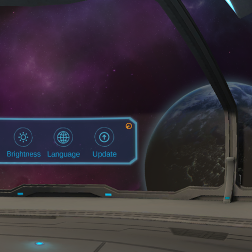
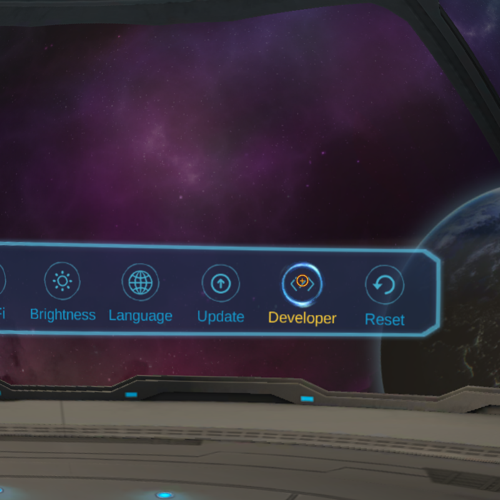
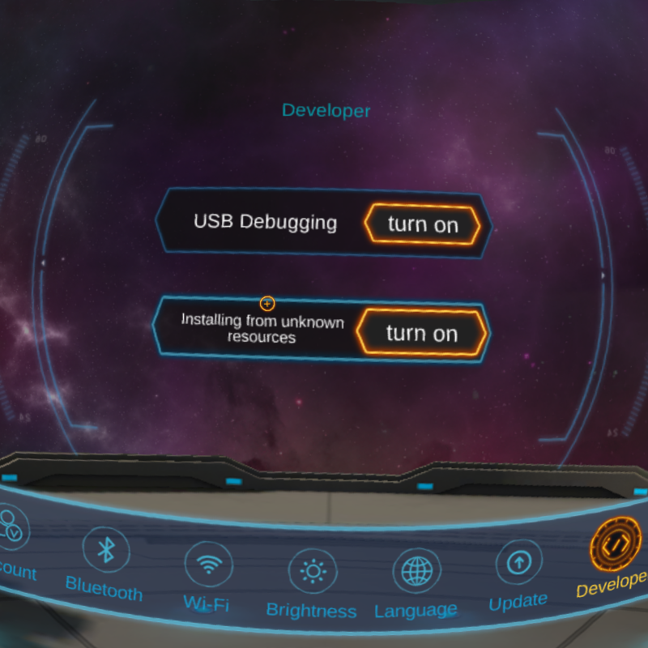

# Idealens developer mode & USB debugging

In the Idealens headset, select the Settings option from the main menu.

  

Select the orange dot located on the top right-hand corner to enable developer mode.

  

Once developer mode has been enabled, select the **Developer** option.

  

Turn on **USB Debugging** and **Install from Unknown sources**

  

## Next: Building to the Idealens headset

See [building to the Idealens headset](/docs/building-to-idealens.md).
