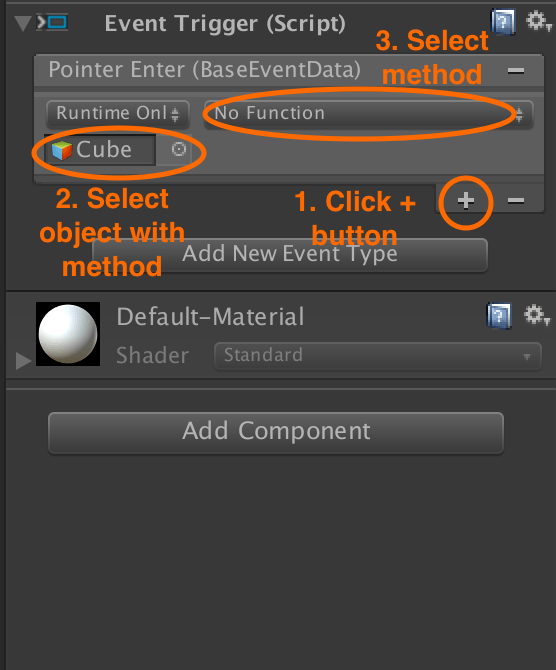

# Idealens Unity SDK camera setup

Remove any existing `MainCamera` or equivalent cameras from your scene.

To add an IVRCamera to your scene, select the **Create IVRCamera Component** from the `IVRSDK` menu.

<p align="center">
  
</p>

## Camera components

The `IVRCamera` has 3 components:

* `RightEye`: manages the right eye’s camera
* `LeftEye`: manages the left eye’s camera
* `Anchor`: serves as the midpoint between the 2 eyes. It can be used to place the anchor and as a raycast launching origin, using a non-activated Camera on Anchor.

In the Unity editor, simulated head movements directly affect `IVRCamera`, but in the Idealens headset, head movements affect `LeftEye` and `RightEye` (while `IVRCamera` remains stationary).

Similarly, in the Unity editor the `LeftEye` and `RightEye` are positioned based on sensible defaults, however in the headset they are positioned based on the interpupillary distance (IPD) and head position set by the system when the application is started.

## Camera parameters

The `IVRCamera` is managed via `IVRManager`, which has the following parameters:

* **Use Reset Position**: Whether to reset the view to the origin when the user long presses on the touch pad
* **Default App Exit**: Whether pressing the default back key exits the application or not.
* **Resolution**: Resolution of the Render Texture of the left and right eye (the larger the resolution, the better the view, but the more system resources it consumes)

## Camera controls

The `IVRCamera` simulates head tracking. It provides the following controls when running your experience within Unity:

* Moving the mouse simulates the user turning their head

## EventSystem setup

The Idealens VR SDK uses Unity’s native `EventSystem` to handle all events, by default.

If you do not already have an `EventSystem` in your scene, select Create `IVREventSystem` from the IVRSDK menu to add one with an IVR Input Module component.

If you already have an `EventSystem` in your scene, attach the `IVRInputModule` script to it and remove the `StandaloneInputModule`.

<p align="center">
  
</p>

`IVRInputModule` extends Unity’s `PointerInputModule` and has the following parameters:

Ray casts

* **Ray Transform**: Events are triggered by raycasts and soIVRInptModule needs to know the launching raycast’s origin transform.Anchor is selected by default.
* **Send Event To All**: Whether to send an event to all colliding objects (not just the closest one)
* **Use IVR Hover**: `EnableIOnHoverHandler` handler interface. Check if you want to be able to trigger events based on hover.

Touchpad Scroll

* **Pixel Drag Threshold**: Threshold value used for when sliding is triggered on the headset’s touch pad.
Use Touch Pad Scroll: Whether to use the touch pad as a parameter wheel. If enabled, the scroll events are not triggered.
* **Touch Pad Scroll Scaler**: The divisor used to calculate the wheel factor from original touch pad movement input.
* **Touch Pad Dead Zone**: Slide movements below this value do not trigger the wheel event.

Standalone Input Module

These values are inherited from `PointerInputModule` and should not normally be modified.

## Raycaster setup

Select **Use IVR Physics Raycast** from the **IVRSDK** menu to connect the camera’s `Anchor` to the `EventSystem`. This automates the following:

* Setting the **Ray Transform** of `IVRInputModule` to `Anchor`.
* Adding the `IVRPhysicsRaycaster` script to `Anchor`.

<p align="center">
  
</p>

`IVRPhysicsRaycaster` inherits from `BaseRaycaster` and is used for detecting physics collisions with the game objects.

You can select which `Layer` the collision detects using an `Event Mask`.

> If the `isTrigger` on a game object’s **Collider** component is not checked, the ray will stop and not reach any game objects positioned behind it.

### GraphicRaycaster

Select the `Canvas` in your scene that you want to respond to gaze or headset interactions, then select it and click on the **Use IVR Graphic Raycast** from the **IVRSDK** menu to connect it to the `EventSystem`. This will automate the following:

* Setting the `Canvas`’s render mode as **World Space** and its **Event Camera** to `Anchor`.
* Adding the `IVRRaycaster` component to the `Canvas`.

`IVRRaycaster` inherits from `GraphicRaycaster` and is used for detecting collisions with `UGUI` elements.

<p align="center">
  
</p>

> The `Canvas` must be rendered as **World Space** in order to appear in the headset.

## Pointer input

The Idealens VR SDK adapts the motion of the headset and presses of the trackpad’s middle button to Unity’s `Pointer*` events. This means you can attach handlers for these events in one of the usual ways:

* Attach an `EventTrigger` with one or more `Pointer*` events
* Attach a script that implements one or more of the [Unity pointer handler interfaces](https://docs.unity3d.com/ScriptReference/EventSystems.IPointerClickHandler.html)


### Using an EventTrigger

Using an `EventTrigger` on your UI component or `GameObject` is the simplest way of responding to gaze-based events and show normally be the preferred method.

Add an `EventTrigger` to your UI component or GameObject.

<p align="center">
  
</p>

Add an event type and select the pointer, drag or scroll event you want to trigger a method.

<p align="center">
  
</p>

If you want to call a method on a script on the current object, add it by dragging it onto your UI component or `GameObject` or by using the **Add Component** button.

Select the object and method you want to call when the event is triggered.

<p align="center">
  
</p>

### Using a pointer handler interface

For greater flexibility, you can use a script that implements one or more of the [Unity pointer handler interfaces](https://docs.unity3d.com/ScriptReference/EventSystems.IPointerClickHandler.html) and attach it to your UI component or GameObject.

For example, a script that responds to when the center button is pressed on the headset has the following structure:

```cs
public class CanvasComponent : MonoBehaviour, IPointerClickHandler
  {
      void OnPointerClick(PointerEventData eventData)
      {

      }
  }
```

Either drag your script onto your UI component or GameObject to add it as a component, or use the **Add Component** button and search for it.

### Pointer hover events

In addition to the Unity pointer handler interfaces the Idealens VR SDK provides one extra handler interface for listening to hover events.

> In order to use the `IOnHoverHandler` interface, the **Use IVR Hover** option must be checked in IVRInputModule’s parameters.

#### IOnHoverHandler.OnHover

Called on an object every frame that the raycast collides with that object and once again when the raycast leaves the object.

```cs
void IOnHoverHandler.OnHover(IVRRayPointerEventData eventData)
```

##### Example

```cs
void IOnHoverHandler.OnHover(BaseEventData eventData) {
      IVRRayPointerEventData pointer = eventData as IVRRayPointerEventData;

      if (pointer == null) return;
      if (pointer.HitResults.Contains(gameObject))
      {
          hitPoint = pointer.HitPoints[pointer.HitResults.IndexOf(gameObject)];
          if (!isHover) RunOnHover(true);
      }
      else if(isHover)
      {
          RunOnHover(false);
          LoseFocus();
      }
  }
```

### Next: Binding to headset buttons

See [Idealens headset buttons](/docs/idealens-buttons.md).

