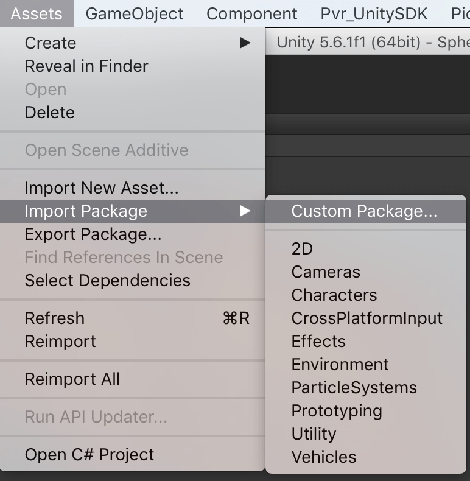
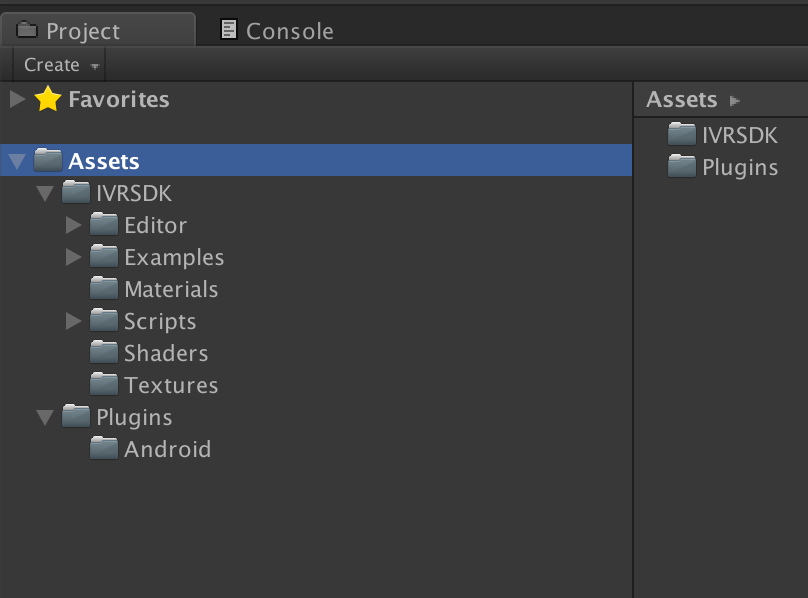
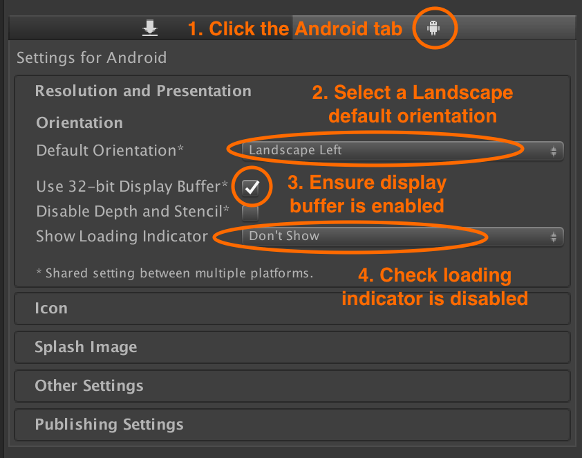
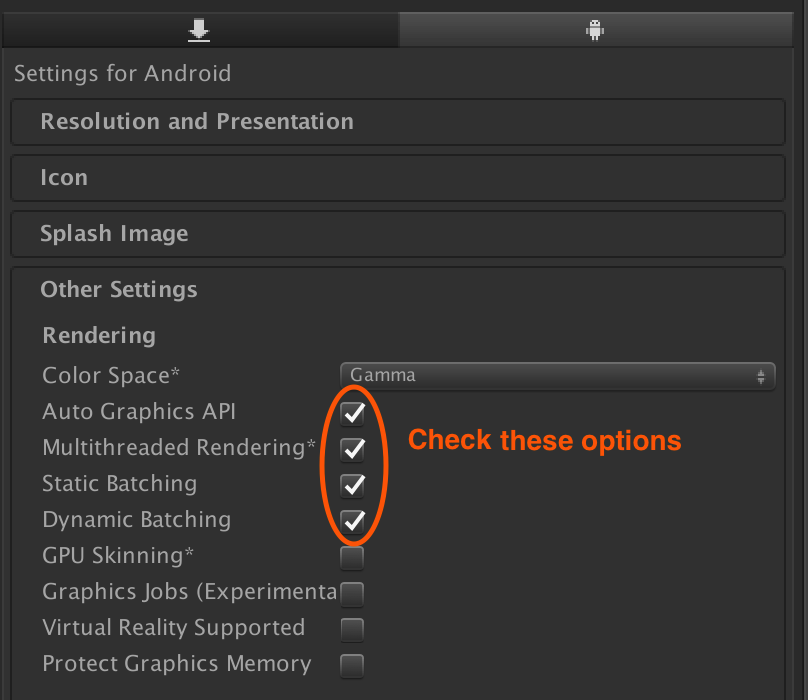
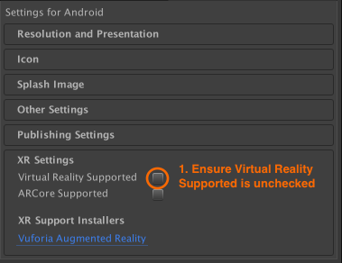
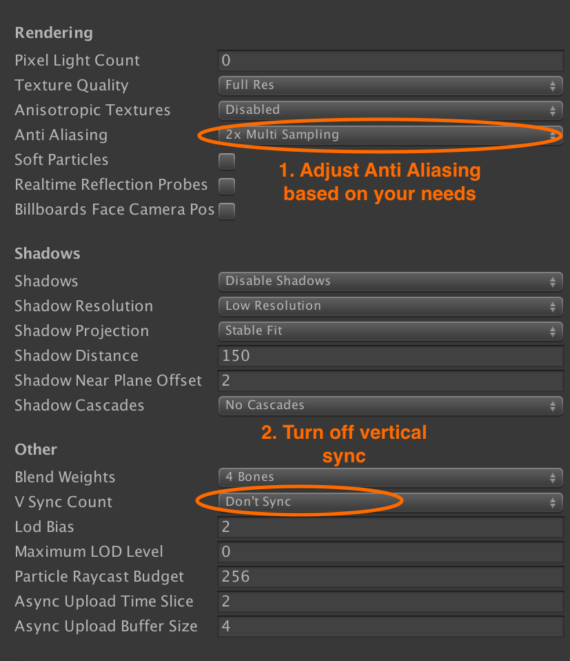

# Idealens VR Unity SDK Installation

The Idealens VR SDK supports developing Unity Virtual Reality experiences that run on the Idealens K2+ headset.

## Importing the unitypackage

The Idealens Unity VR SDK comes as a .unitypackage that you can import into your project via the **Assets › Import Package › Custom Package...** menu option in Unity.

You can <a href="https://users.wearvr.com/developers/devices/idealens-k2/resources/vr-unity-package" target="_blank">download the Idealens VR Unity SDK</a> from WEARVR. You will be asked to create or sign in to your developer account.

  

This will add a number of directories to your project:

  

## Project settings

## Player settings

Open **Edit › Project Settings › Player**. In the Android tab, change your project settings to match the following:

  

### Set rendering options

Under **Other Settings**, set the following rendering options:

  

### Disable bundled Unity VR SDKs

Depending on the version of Unity you are using, the **Virtual Reality Supported** option can be found in **Other Settings** or **XR Settings**. Make sure it is **NOT** checked to avoid conflicts with the Idealens VR SDK.

  

### Disable the splash screen

As the VR cameras only initialise after the splash screen has been displayed, the splash image does not display correctly in the headset.

If you are using the premium version of Unity, it is recommended to disable the splash screen and set the static splash image to a solid black image in **Project Settings**.

  

## Quality Settings

Open **Edit › Project Settings › Quality**. Update your quality settings to match the recommended setting below. Vertical sync **must** be turned off.

  

### Next: Camera setup and input

See [Camera & input module setup](/docs/idealens-vr-camera-setup.md)
